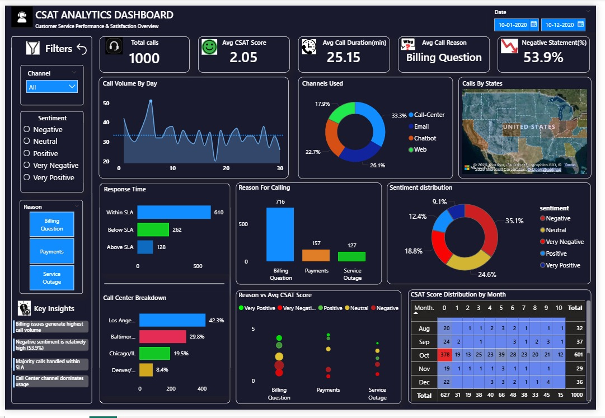

# CSAT (Customer Satisfaction) Analysis

## Project Overview
This project analyzes customer satisfaction 
data entirely using Power BI — including data 
cleaning, transformation, DAX measures and 
interactive dashboard creation to deliver 
actionable business insights.

---

## Objective
To analyze customer feedback and satisfaction 
scores, identify patterns in positive and 
negative responses, and provide data-driven 
recommendations to enhance customer 
satisfaction.

---

## Tools & Technologies
| Tool | Purpose |
|------|---------|
| Power BI | Complete Analysis & Visualization |
| Power Query | Data Cleaning & Transformation |
| DAX | Custom Measures & Calculations |
| Excel | Raw Data Source |

---

## Process
1. Data Import & Understanding
2. Data Cleaning in Power Query
3. Column Creation & Transformation
4. Conditional & Custom Columns
5. DAX Measures Creation
6. Exploratory Data Analysis (EDA)
7. Dashboard Design & Visualization
8. Business Insights & Recommendations 

---

## Power BI Features Used
- Power Query — Data cleaning & shaping
- Conditional Columns — Category creation
- Custom Columns — Derived fields
- DAX Measures — KPI calculations
- Interactive Visuals — Filters & slicers
- Dashboard — Final reporting

---

## Key Findings
- Billing issues generate highest 
  call volume
- Negative sentiment is relatively 
  high at 53.9%
- Majority of calls handled within SLA
- Call Center channel dominates usage
- Avg CSAT Score: 2.05

---

## Dashboard Preview

---

## Files in this Repository
| File | Description |
|------|-------------|
| csat_analysis.pbix | Power BI project file |
| dataset.csv | Sample dataset (1000 records) |
| dashboard.jpg | Power BI dashboard screenshot |

---

## Outcome
Successfully identified key factors impacting 
customer satisfaction using end-to-end Power BI 
analysis — from raw data cleaning to interactive 
dashboard delivery.

---

## Author
**Preethi M**  
Aspiring Data Analyst  
📧 preethiii.m1905@gmail.com  
🔗 [LinkedIn](https://www.linkedin.com/in/preethi-m-9864a3384/)
